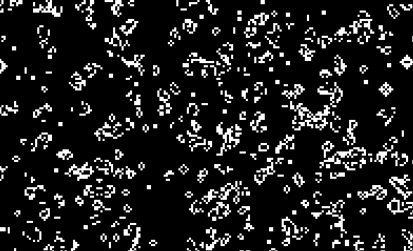

# Cellular-Automata-2D

This is a simple implementation of Conway's Game of Life using C++ and SFML Library for Graphics.

- - - -

## Example :


## Build 🛠️
1. Make sure you have SFML installed. You can download it from [SFML's official website](https://www.sfml-dev.org/).
2. Clone this Repository to local device,
``` bash
https://github.com/Shubhm1shra/Cellular-Automata-2D.git
```
3. Compile by running build.bat

## Run 🏃‍♂️
Run the executable,
``` bash
./main
```

## Controls 🕹️
Press Escape Key to exit.

## Customize 🧩
Feel Free to customize the parameters in `main.cpp` file, to change number of rows, number of columns, Cell size.

Thank you!
